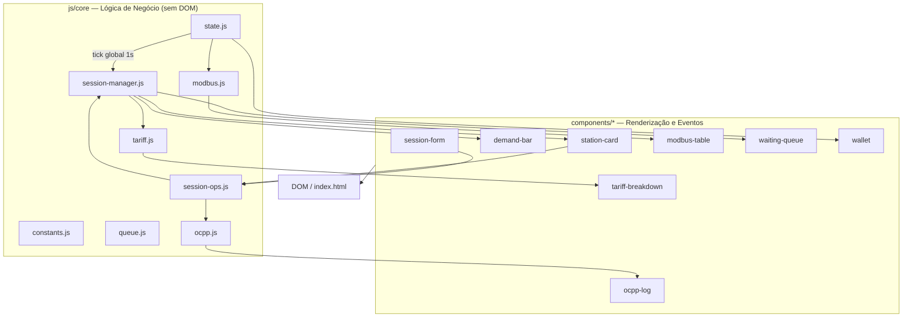
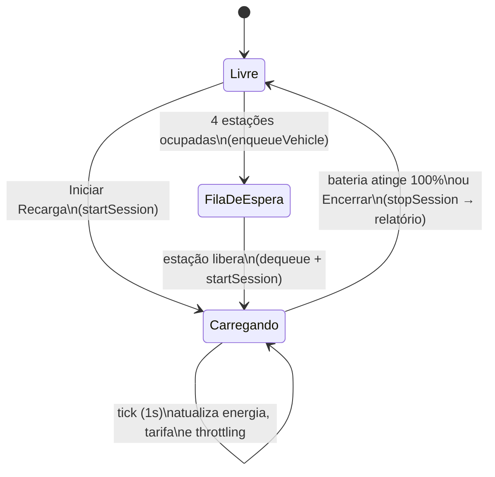
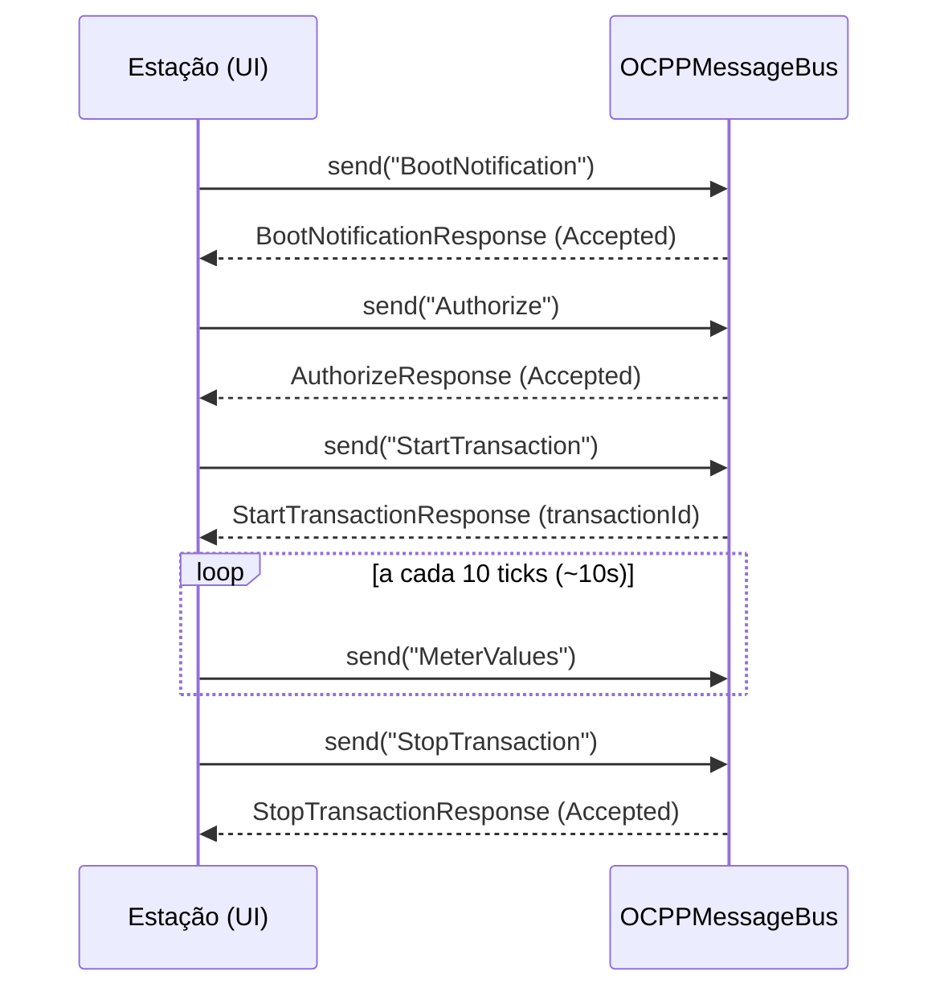

# ⚡ Thunderbolt — Gestão de Estações de Recarga GoodWe
### Sprint 2 — Prova de Conceito Funcional (DSA + SERS)

Prova de Conceito (PoC) que simula um **hub de recarga com múltiplas estações de veículos elétricos**, capaz de gerenciar sessões simultâneas, aplicar regras de controle de potência baseadas na capacidade da rede, calcular tarifas dinâmicas e simular a comunicação com sistemas externos via protocolos **OCPP 1.6** e **MODBUS**.

A solução evolui o protótipo da Sprint 1 (sessão única, simulador financeiro) para um **sistema de gerenciamento de energia do lado da demanda (Demand-Side Management — DSM)**, aplicando os conceitos de eficiência energética e integração com energias renováveis trabalhados na disciplina de SERS.

---

## 1. Visão Geral

O sistema é uma aplicação web 100% front-end (HTML, CSS e JavaScript puro, sem frameworks ou build step), organizada em **4 estações de recarga (A–D)** conectadas a uma **rede com capacidade limitada de 50 kW**. Cada estação pode receber um veículo, configurar um plano de recarga e iniciar uma sessão — que passa a ser monitorada em tempo real por um *tick* global de 1 segundo.

Principais capacidades demonstradas:

- Gerenciamento de **múltiplas sessões simultâneas** (`Map<stationId, Session>`).
- **Controle de potência por demanda da rede**, com *throttling* proporcional quando a capacidade é excedida.
- **Tarifação dinâmica** composta por 4 fatores: tarifa base do plano, faixa horária, nível de demanda da rede e tipo de usuário.
- **Fila de espera (FIFO)** para veículos quando todas as estações estão ocupadas.
- Simulação de comunicação com sistema externo via **OCPP 1.6** (mensagens de transação) e **MODBUS** (registros de telemetria).
- Carteira virtual com histórico de transações e persistência em `localStorage`.

---

## 2. Sustentabilidade e Eficiência Energética (SERS)

O Thunderbolt não simula apenas finanças — sua arquitetura de tarifação e controle de potência foi desenhada para **incentivar comportamentos que reduzem a pressão sobre a rede elétrica e aumentam o aproveitamento de geração renovável**.

### 2.1 Tarifação por faixa horária (Demand-Side Management)

| Faixa | Horário | Multiplicador | Justificativa técnica |
|---|---|---|---|
| Madrugada | 00h–06h | × 0,70 | Período de baixa demanda no Sistema Interligado Nacional, em que a geração de base é predominantemente **hidrelétrica** e, em regiões com forte potencial eólico, beneficiada pela **complementariedade eólico-hidráulica** (ventos mais intensos no período noturno). |
| Diurno | 06h–18h | × 1,00 | Tarifa de referência — consumo dentro da curva normal de operação da rede. |
| Pico | 18h–22h | × 1,30 | Horário de maior demanda residencial, em que o despacho marginal recorre a **usinas termelétricas de ponta** (gás, óleo), as mais caras e mais intensivas em carbono da matriz. |

Ao tornar a recarga **mais barata na madrugada e mais cara no horário de pico**, o sistema cria um incentivo econômico direto para que o usuário desloque seu consumo para o período em que a energia consumida tem maior participação de fontes renováveis e menor custo marginal — exatamente o objetivo de um programa de **DSM (Demand-Side Management)**.

### 2.2 Limite de capacidade da rede e *throttling*

A constante `GRID_CAPACITY_KW = 50` representa a capacidade máxima do ponto de conexão (ex.: transformador/alimentador local) que atende as 4 estações. A cada *tick*, `applyThrottling()` verifica a soma da potência de todas as sessões ativas:

- Se o total **não excede** 50 kW, cada sessão recebe sua potência nominal (`powerMax`).
- Se o total **excede** 50 kW, a potência de **todas** as sessões é reduzida proporcionalmente: `fator = GRID_CAPACITY_KW / total`, e `power = powerMax × fator`.

Essa regra simula um cenário real de infraestrutura de recarga conectada a uma rede com capacidade finita — comum em instalações que dependem de geração distribuída (solar/eólica local) ou de alimentadores já no limite. Em vez de desligar estações ou recusar atendimento, o sistema **redistribui a energia disponível de forma proporcional**, maximizando o número de veículos atendidos simultaneamente sem exigir reforço de infraestrutura.

### 2.3 Tarifa por nível de demanda

Além da faixa horária, o preço por kWh também responde ao **percentual de ocupação da capacidade da rede no momento**:

| Faixa de demanda | Multiplicador adicional |
|---|---|
| 0% – 40% | × 1,00 |
| 40% – 70% | × 1,10 |
| 70% – 90% | × 1,25 |
| > 90% | × 1,50 |

Esse mecanismo funciona como um **sinal de preço em tempo real**: quanto mais próxima a rede está do seu limite, mais cara fica a recarga — desincentivando novas sessões em momentos de alta demanda e incentivando o uso da rede em horários de menor utilização, o que reduz a necessidade de expansão de capacidade e melhora o fator de utilização da infraestrutura existente.

### 2.4 Usuários Premium

Usuários Premium recebem desconto de 15% (× 0,85) sobre a tarifa já ajustada pelos fatores acima — um benefício de fidelização que não altera a lógica de DSM, apenas se aplica como último fator multiplicativo.

---

## 3. Arquitetura do Sistema (DSA)

### 3.1 Princípio de organização

O código é dividido em duas camadas com responsabilidades estritamente separadas:

- **`js/core/`** — lógica de negócio pura. Não manipula o DOM. Contém estado global, regras de tarifação, gerenciamento de sessões, *throttling*, e os simuladores de protocolo (OCPP/MODBUS).
- **`components/<nome>/`** — um componente por pasta, cada um com seu `.js` (renderização + eventos) e `.css` (estilo escopado). Componentes **chamam** funções de `js/core/`, mas nunca implementam regras de negócio.

Comunicação entre arquivos é feita via escopo global (`window`), sem `import`/`export` — todos os scripts são carregados em sequência pelo `index.html`.

### 3.2 Estrutura de pastas

```text
second-sprint/
├── index.html
├── css/
│   └── base/
│       ├── tokens.css        → variáveis de design (cores, espaçamento, tipografia)
│       ├── reset.css
│       ├── animations.css
│       ├── buttons.css
│       └── forms.css
├── js/core/
│   ├── constants.js          → PLANS, GRID_CAPACITY_KW, MAX_STATIONS, STATION_IDS
│   ├── helpers.js             → formatBRL, formatDuration, calcCurrentPct, calcEnergyDelivered
│   ├── queue.js                → classe Queue (FIFO)
│   ├── tariff.js                → tariffRules, calcPricePerKwh, getTariffBreakdown
│   ├── ocpp.js                  → OCPPMessageBus
│   ├── modbus.js               → modbusRegisters, updateModbusFromSession
│   ├── session-manager.js   → activeSessions (Map), waitingQueue, throttling
│   ├── session-ops.js         → startSession, stopSession
│   └── state.js                  → wallet, sessionHistory, tick global, persistência
└── components/
    ├── sidebar/              → navegação entre seções
    ├── station-card/         → cards das estações A–D (ociosa/carregando)
    ├── demand-bar/           → barra de potência total vs. capacidade da rede
    ├── session-form/         → modal de configuração de nova sessão
    ├── tariff-breakdown/     → breakdown "base × horário × demanda × tipo"
    ├── ocpp-log/             → log de mensagens OCPP em tempo real
    ├── modbus-table/        → tabela de holding registers MODBUS
    ├── waiting-queue/        → fila de veículos aguardando
    ├── wallet/               → carteira e histórico de transações
    └── explanation/          → seção didática com a explicação dos conceitos
```

### 3.3 Diagrama de Arquitetura



---

## 4. Estruturas de Dados e Algoritmos

| Estrutura | Onde | Justificativa de complexidade |
|---|---|---|
| **`Map<stationId, Session>`** (`activeSessions`) | `session-manager.js` | Acesso, inserção e remoção de sessões em **O(1)** por chave (`stationId`), sem necessidade de percorrer arrays para localizar uma estação. |
| **`Queue` (FIFO)** (`waitingQueue`, `OCPPMessageBus.queue`) | `queue.js` | `enqueue`/`dequeue` em **O(1)** via `push`/`shift`. Garante que o primeiro veículo a entrar na fila seja o primeiro a ser atendido quando uma estação se libera. |
| **Lookup table de regras de tarifa** (`tariffRules.demand`) | `tariff.js` | Array ordenado percorrido com `.reverse().find()` — busca linear **O(n)** sobre um conjunto pequeno e fixo (4 faixas), priorizando legibilidade sobre micro-otimização. |
| **Algoritmo de distribuição proporcional** (`applyThrottling`) | `session-manager.js` | **O(n)** sobre as sessões ativas (no máximo 4) — recalcula a potência de cada sessão como `powerMax × (capacidade / total)`, redistribuindo a capacidade disponível de forma justa. |
| **Arrays de histórico com `unshift()`** (`sessionHistory`, `wallet.transactions`, `ocppBus.messageLog`) | `state.js`, `ocpp.js` | Inserções no início mantêm a ordem cronológica inversa (mais recente primeiro) diretamente na estrutura, sem necessidade de reordenação na renderização. |
| **Objeto registro indexado por endereço** (`modbusRegisters`) | `modbus.js` | Acesso em **O(1)** por endereço hexadecimal (`0x0001`...`0x0005`), refletindo o modelo real de *holding registers* MODBUS. |
| **Tick global único** (`setInterval` 1s) | `state.js` | Um único *interval* itera sobre `activeSessions` a cada segundo, evitando múltiplos timers por sessão e eliminando vazamento de `intervalId` ao encerrar sessões. |

---

## 5. Modelagem de uma Sessão de Recarga

```js
{
  id: "sess_1718472000000",
  stationId: "A",
  vehicleId: "VH-A-8587",
  userId: "user_123",
  userType: "premium",     // "standard" | "premium"
  plan: { id: "plus", name: "Plus", power: 7.4, pricePerKwh: 1.10 },
  power: 7.4,               // kW alocado no momento (pode estar throttled)
  powerMax: 7.4,            // kW nominal do plano
  pricePerKwh: 1.52,        // tarifa efetiva já calculada
  startTime: Date,
  elapsedMinutes: 9,
  totalMinutes: 487,        // tempo estimado até 100%
  initialPct: 38,
  batteryCapacity: 75,      // kWh
  status: "charging",       // "charging" | "queued" | "done"
}
```

### Ciclo de vida da sessão



A cada `Encerrar` (ou ao atingir 100% de carga), `stopSession()` gera um **registro de relatório** (energia entregue, custo total, duração, % inicial→final), que é adicionado ao histórico e debitado da carteira virtual.

---

## 6. Tarifação Dinâmica — Cálculo Detalhado

O preço efetivo por kWh é o resultado de **quatro fatores multiplicativos** aplicados sobre a tarifa base do plano:

```
preço_efetivo = base_do_plano × multiplicador_horário × multiplicador_demanda × multiplicador_usuário
```

| Fator | Valores possíveis |
|---|---|
| **Base do plano** | Básico R$ 1,40 · Plus R$ 1,10 · Ultra R$ 0,80 (por kWh) |
| **Horário** | Madrugada (0–6h) × 0,70 · Diurno (6–18h) × 1,00 · Pico (18–22h) × 1,30 |
| **Demanda da rede** | < 40% × 1,00 · 40–70% × 1,10 · 70–90% × 1,25 · > 90% × 1,50 |
| **Tipo de usuário** | Padrão × 1,00 · Premium × 0,85 |

**Exemplo** — Plano Plus, horário de pico, demanda em 75%, usuário Premium:

```
R$ 1,10  ×  1,30 (pico)  ×  1,25 (demanda 75%)  ×  0,85 (premium)  =  R$ 1,52 / kWh
```

Esse *breakdown* é exibido em tempo real na interface para cada sessão ativa, permitindo observar como cada fator contribui para o custo final.

---

## 7. Protocolos Simulados — OCPP 1.6 e MODBUS

A integração com sistema externo é simulada através de dois protocolos amplamente usados em eletropostos reais.

### 7.1 OCPP 1.6 (Open Charge Point Protocol)

Cada mensagem é representada como um *frame* `[messageTypeId, uniqueId, action, payload]`, onde `2` = Call (envio) e `3` = CallResult (resposta). O `OCPPMessageBus` enfileira o envio, registra no log e simula a resposta automática após 300ms.



Esse fluxo é disparado automaticamente: `startSession()` envia `BootNotification → Authorize → StartTransaction`; o tick global envia `MeterValues` periodicamente; `stopSession()` envia `StopTransaction`. Todas as mensagens ficam visíveis no log da aba **Protocolo**.

### 7.2 MODBUS — Holding Registers

A cada tick, `updateModbusFromSession()` atualiza um conjunto de registros simulando a leitura de um medidor de energia conectado à estação:

| Endereço | Grandeza | Unidade | Fator de escala |
|---|---|---|---|
| `0x0001` | Tensão | V | 0,1 |
| `0x0002` | Corrente | A | 0,1 |
| `0x0003` | Potência Ativa | W | 1 |
| `0x0004` | Energia Total | Wh | 1 |
| `0x0005` | Temperatura | °C | 0,1 |

O valor "real" exibido é `valor_bruto × fator_de_escala`, replicando o modelo de registros de 16 bits usado em medidores reais via MODBUS.

---

## 8. Instruções de Uso

### 8.1 Pré-requisitos

Nenhum — o projeto é front-end puro (HTML/CSS/JS), sem dependências ou build step.

### 8.2 Executando o protótipo

1. Clone o repositório:
   ```bash
   git clone https://github.com/goodwe-challenge/sprints.git
   ```
2. Navegue até `data-structures-and-algorithms/second-sprint/`.
3. Abra o arquivo `index.html` em qualquer navegador moderno (Chrome, Edge, Firefox).

### 8.3 Demonstração guiada

Na aba **Sessões**, a seção "Demonstração" oferece botões que populam o sistema instantaneamente:

| Botão | O que faz |
|---|---|
| **Simular 3 Veículos** | Inicia sessões nas estações A, B e C com planos e perfis diferentes, deixando a D livre. |
| **Encerrar Todos** | Finaliza todas as sessões ativas e gera os relatórios correspondentes. |
| **Simular Demanda Máxima** | Inicia 4 sessões no plano Ultra (22 kW cada = 88 kW solicitados), forçando o *throttling* (cada estação passa a receber ~12,5 kW). |
| **Simular Fila de Espera** | Ocupa as 4 estações e adiciona um 5º veículo à fila FIFO. |
| **Simular Horário de Pico** | Alterna o horário simulado para 20h, ativando a tarifa de pico (× 1,30) em tempo real. |

### 8.4 Fluxo manual

1. Em uma estação livre, clique em **Iniciar Recarga**.
2. No modal, informe o ID do veículo, tipo de usuário (Padrão/Premium), plano (Básico/Plus/Ultra), capacidade da bateria (kWh) e carga inicial (%).
3. Confirme — o sistema dispara o handshake OCPP (`BootNotification → Authorize → StartTransaction`) e a sessão entra em modo **Carregando**.
4. Acompanhe em tempo real: barra de bateria, potência alocada (com seta ↑/↓ indicando *throttling*), tempo decorrido e custo acumulado.
5. Consulte a aba **Protocolo** para ver o log OCPP e a tabela MODBUS atualizando a cada segundo.
6. Clique em **Encerrar** (ou aguarde 100%) para finalizar — o relatório da sessão é debitado da **Carteira** e arquivado no histórico.
7. A aba **Explicação** detalha, de forma didática, cada um dos conceitos acima (sessões, *throttling*, tarifação e protocolos).
