# Thunderbolt Sprint 2: Documentação Técnica

**Sistema Inteligente de Gerenciamento de Recarga (GoodWe Challenge)**

Este documento descreve a arquitetura, as estruturas de dados e a implementação da prova de conceito Thunderbolt Sprint 2. A aplicação é um simulador de estações de recarga para veículos elétricos executado no navegador, construído com JavaScript puro. O sistema gerencia múltiplas sessões simultâneas, aplica controle de demanda de potência, implementa lógica de tarifação dinâmica, simula integração com protocolos OCPP e MODBUS e gera relatórios operacionais por meio de um menu interativo.

---

## Sumário

1. [Visão Geral do Sistema](#1-visão-geral-do-sistema)
2. [Arquitetura](#2-arquitetura)
3. [Estruturas de Dados Principais](#3-estruturas-de-dados-principais)
4. [Mapeamento dos Critérios de Avaliação](#4-mapeamento-dos-critérios-de-avaliação)
5. [Ciclo de Vida da Sessão](#5-ciclo-de-vida-da-sessão)
6. [Simulação de Protocolos](#6-simulação-de-protocolos)
7. [Menu Interativo e Cenários de Demonstração](#7-menu-interativo-e-cenários-de-demonstração)
8. [Persistência e Robustez](#8-persistência-e-robustez)
9. [Estrutura do Projeto](#9-estrutura-do-projeto)
10. [Como Executar](#10-como-executar)

---

## 1. Visão Geral do Sistema

O Thunderbolt Sprint 2 evolui o simulador de sessão única da Sprint 1 para uma plataforma de gerenciamento de recarga multiestação. O sistema modela um hub de carregamento com quatro conectores físicos (estações A, B, C e D), capacidade compartilhada da grade de 50 kW e uma carteira virtual para cobrança.

### Entregáveis da Sprint 2


| Entregável                      | Implementação                                                                             |
| ------------------------------- | ----------------------------------------------------------------------------------------- |
| Código em JavaScript            | ES6 puro, sem frameworks ou bundler                                                       |
| Execução com múltiplos cenários | Botões de demonstração para 3+ veículos, demanda máxima, horário de pico e fila de espera |
| Menu interativo                 | Navegação lateral com seções Sessões, Protocolo, Carteira e Explicação                    |
| Documento técnico               | Este arquivo (`technical-document.md`)                                                    |


### Resultado Esperado

O sistema, simultaneamente:

- Gerencia várias sessões de recarga de veículos
- Controla a demanda total de energia da grade por throttling proporcional
- Aplica precificação dinâmica com base no horário, carga da grade e tipo de usuário
- Simula comunicação bidirecional com plataforma externa (OCPP 1.6 e registros MODBUS)
- Produz relatórios de sessão e histórico de transações da carteira

---

## 2. Arquitetura

A base de código segue uma separação rigorosa de responsabilidades. A lógica de negócio reside em `js/core/` e nunca acessa o DOM. Os componentes de interface em `components/` tratam apenas de renderização e eventos do usuário. O estado global é compartilhado via escopo `window` por meio de tags `<script>` carregadas em sequência.

### 2.1 Arquitetura em Camadas

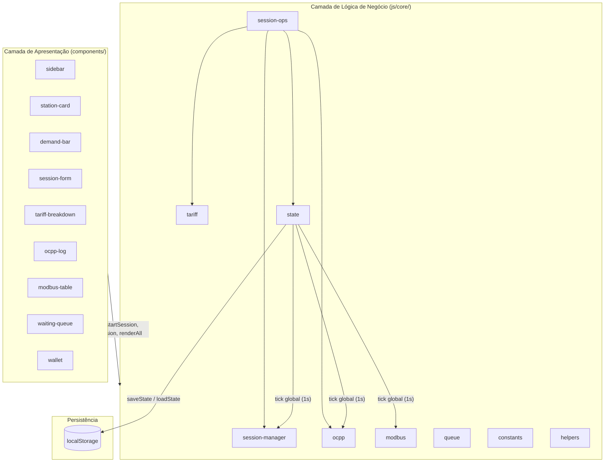


### 2.2 Grafo de Dependências dos Módulos

Os scripts carregam na ordem de dependência definida em `index.html`:

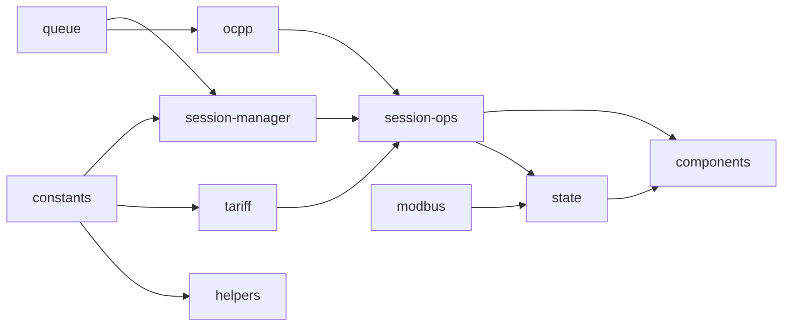


### 2.3 Fluxo de Dados em Tempo de Execução

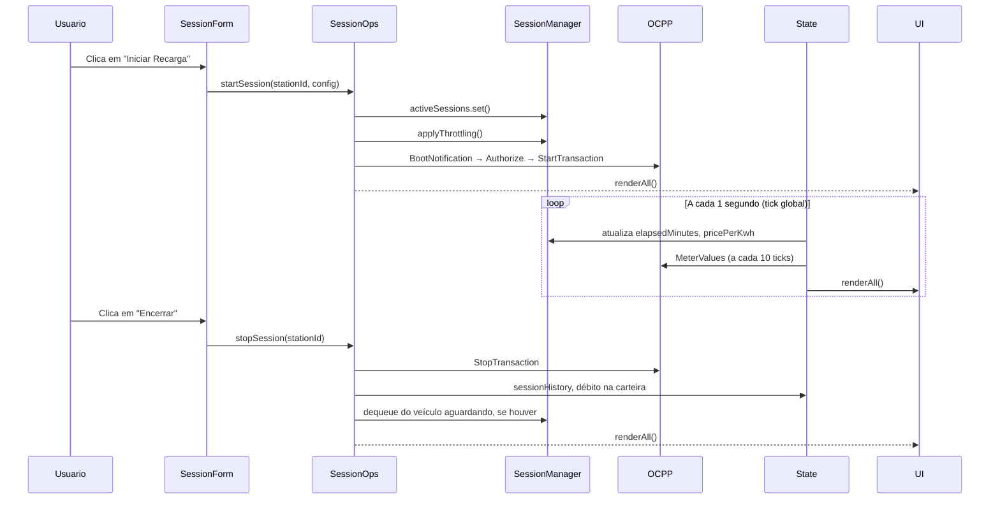


### 2.4 Princípios de Design


| Princípio                    | Onde se Aplica                                                                                |
| ---------------------------- | --------------------------------------------------------------------------------------------- |
| Tick global único            | Um `setInterval` em `state.js` itera todas as sessões ativas. Sem timers por sessão.          |
| Funções puras                | `helpers.js` e `tariff.js` contêm cálculos sem efeitos colaterais.                            |
| Lookup O(1) de sessão        | `Map<stationId, SessionObject>` para acesso em tempo constante por estação.                   |
| Fila FIFO                    | Classe `Queue` para escalonamento justo quando todas as estações estão ocupadas.              |
| Isolamento de componentes    | Nenhuma lógica de negócio dentro de `components/`. Componentes chamam apenas funções do core. |
| Limite de tamanho de arquivo | Cada arquivo `.js` e `.css` permanece abaixo de 100 linhas.                                   |


---

## 3. Estruturas de Dados Principais

### 3.1 Map de Sessões Ativas

```javascript
const activeSessions = new Map(); // Map<stationId, SessionObject>
```

Cada `SessionObject` contém:


| Campo             | Tipo   | Finalidade                                                  |
| ----------------- | ------ | ----------------------------------------------------------- |
| `id`              | string | Identificador único da sessão (`sess_<timestamp>`)          |
| `stationId`       | string | Rótulo do conector: `"A"`, `"B"`, `"C"` ou `"D"`            |
| `vehicleId`       | string | Identificador do veículo                                    |
| `userId`          | string | Tag do usuário para autorização OCPP                        |
| `userType`        | string | `"standard"` ou `"premium"`                                 |
| `plan`            | object | Referência a um plano de `PLANS`                            |
| `power`           | number | kW alocados no momento (pode estar reduzido por throttling) |
| `powerMax`        | number | Potência nominal do plano em kW                             |
| `pricePerKwh`     | number | Tarifa efetiva no tick atual                                |
| `startTime`       | Date   | Timestamp de início da sessão                               |
| `elapsedMinutes`  | number | Tempo de recarga simulado decorrido                         |
| `totalMinutes`    | number | Tempo estimado até carga completa                           |
| `initialPct`      | number | Percentual da bateria no início                             |
| `batteryCapacity` | number | Capacidade da bateria em kWh                                |
| `status`          | string | `"charging"`, `"queued"` ou `"done"`                        |


**Complexidade:** Inserção, busca e remoção são O(1) via `Map`. A iteração sobre sessões ativas é O(n), onde n é o número de sessões simultâneas (máximo 4).

### 3.2 Fila de Espera (FIFO)

```javascript
class Queue {
  constructor() { this.items = []; }
  enqueue(item)  { this.items.push(item); }
  dequeue()      { return this.items.shift(); }
  peek()         { return this.items[0]; }
  get size()     { return this.items.length; }
  get isEmpty()  { return this.items.length === 0; }
}
```

Quando uma estação fica livre, `stopSession()` remove o próximo veículo da fila e chama `startSession()` automaticamente.

### 3.3 Tabela de Regras de Tarifação

```javascript
const tariffRules = {
  night:    { start: 0,  end: 6,  multiplier: 0.70 },
  standard: { start: 6,  end: 18, multiplier: 1.00 },
  peak:     { start: 18, end: 22, multiplier: 1.30 },
  premium:  { discount: 0.85 },
  demand: [
    { threshold: 0.0, multiplier: 1.00 },
    { threshold: 0.4, multiplier: 1.10 },
    { threshold: 0.7, multiplier: 1.25 },
    { threshold: 0.9, multiplier: 1.50 },
  ],
};
```

A faixa de demanda é resolvida invertendo o array e encontrando a primeira regra em que `demandRatio >= threshold`. Complexidade O(k) com k = 4 faixas.

### 3.4 Log de Mensagens OCPP

```javascript
class OCPPMessageBus {
  messageLog = [];  // Array, mais recente primeiro via unshift()
  queue = new Queue(); // Frames de saída pendentes
}
```

Cada entrada do log: `{ ts, direction, action, payload }`. Limitado a 50 entradas.

### 3.5 Registros MODBUS (Holding Registers)

```javascript
const modbusRegisters = {
  0x0001: { value, label: "Tensão",         unit: "V",  factor: 0.1 },
  0x0002: { value, label: "Corrente",         unit: "A",  factor: 0.1 },
  0x0003: { value, label: "Potência Ativa",  unit: "W",  factor: 1   },
  0x0004: { value, label: "Energia Total",   unit: "Wh", factor: 1   },
  0x0005: { value, label: "Temperatura",     unit: "°C", factor: 0.1 },
};
```

Os valores físicos são calculados como `valorBruto * factor`.

### 3.6 Estado Persistente

```javascript
const state = {
  wallet: { balance: 100, transactions: [] },
  sessionHistory: [],
};
```

Ambas as estruturas usam `unshift()` para ordenação do mais recente ao mais antigo. Persistidas no `localStorage` com as chaves `ss2_wallet` e `ss2_history`.

---

## 4. Mapeamento dos Critérios de Avaliação

Esta seção relaciona cada critério de avaliação da Sprint 2 à sua implementação concreta, faixa de nota esperada e arquivos fonte relevantes.

---

### Critério 1: Gerenciamento de Múltiplas Sessões (0–20 pontos)

#### O que o critério exige

Simular 3 ou mais veículos com gerenciamento organizado de sessões concorrentes.

#### Como está implementado

O sistema substitui o objeto singular `activeSession` da Sprint 1 por um `Map` indexado pelo ID da estação. Até quatro sessões rodam simultaneamente, uma por conector.

**Arquivos principais:**


| Arquivo                      | Papel                                                           |
| ---------------------------- | --------------------------------------------------------------- |
| `js/core/session-manager.js` | Declara o `Map` `activeSessions` e a `waitingQueue`             |
| `js/core/session-ops.js`     | Ciclo de vida `startSession()` e `stopSession()`                |
| `components/station-card/`   | Um card por estação com bateria, potência e custo em tempo real |
| `components/waiting-queue/`  | Fila FIFO visual quando todas as estações estão ocupadas        |


**Criação de sessão** (`session-ops.js`):

```javascript
activeSessions.set(stationId, session);
applyThrottling();
```

**Demonstração multi-veículo** (script inline em `index.html`):

```javascript
function demoStartAll() {
  const demos = [
    { stationId: "A", vehicleId: "VH-01", planId: "ultra",  ... },
    { stationId: "B", vehicleId: "VH-02", planId: "plus",   ... },
    { stationId: "C", vehicleId: "VH-03", planId: "basic",  ... },
  ];
  demos.forEach(cfg => startSession(cfg.stationId, cfg));
}
```

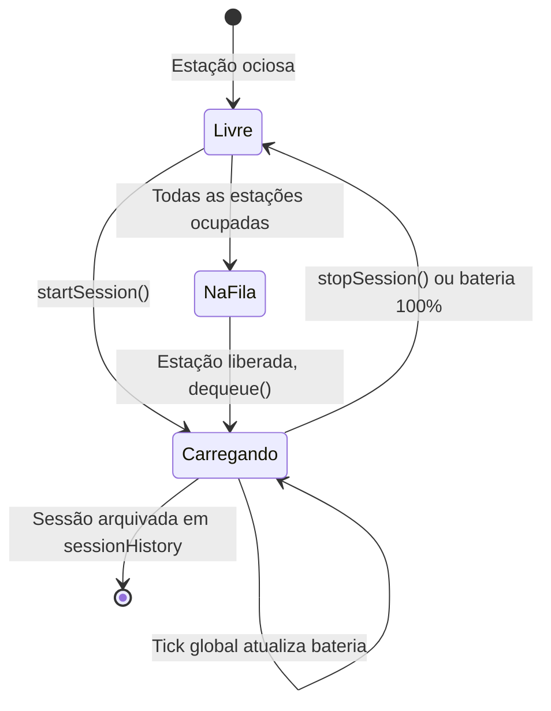


#### Evidências na interface

- Grade de 4 cards de estação (A, B, C, D) com badges de status independentes
- Cada card exibe ID do veículo, barra de progresso da bateria, potência alocada, tempo decorrido e custo acumulado
- Botão "Simular 3 Veículos" inicia três sessões concorrentes instantaneamente
- Painel da fila de espera mostra posição, ID do veículo e plano dos veículos aguardando

---

### Critério 2: Controle de Demanda de Energia (0–20 pontos)

#### O que o critério exige

Limitar a potência de recarga quando muitos veículos estão conectados. A grade deve impor uma capacidade máxima.

#### Como está implementado

**Constantes** (`constants.js`):

```javascript
const GRID_CAPACITY_KW = 50;
const MAX_STATIONS = 4;
```

**Agregação de potência** (`session-manager.js`):

```javascript
function calcTotalActivePower() {
  let total = 0;
  activeSessions.forEach(s => { total += s.power; });
  return total;
}
```

**Throttling proporcional** (`session-manager.js`):

```javascript
function applyThrottling() {
  const total = calcTotalActivePower();
  if (total > GRID_CAPACITY_KW) {
    const factor = GRID_CAPACITY_KW / total;
    activeSessions.forEach(s => { s.power = s.powerMax * factor; });
  } else {
    activeSessions.forEach(s => { s.power = s.powerMax; });
  }
}
```

O throttling executa a cada início e fim de sessão, garantindo que a grade nunca ultrapasse 50 kW.

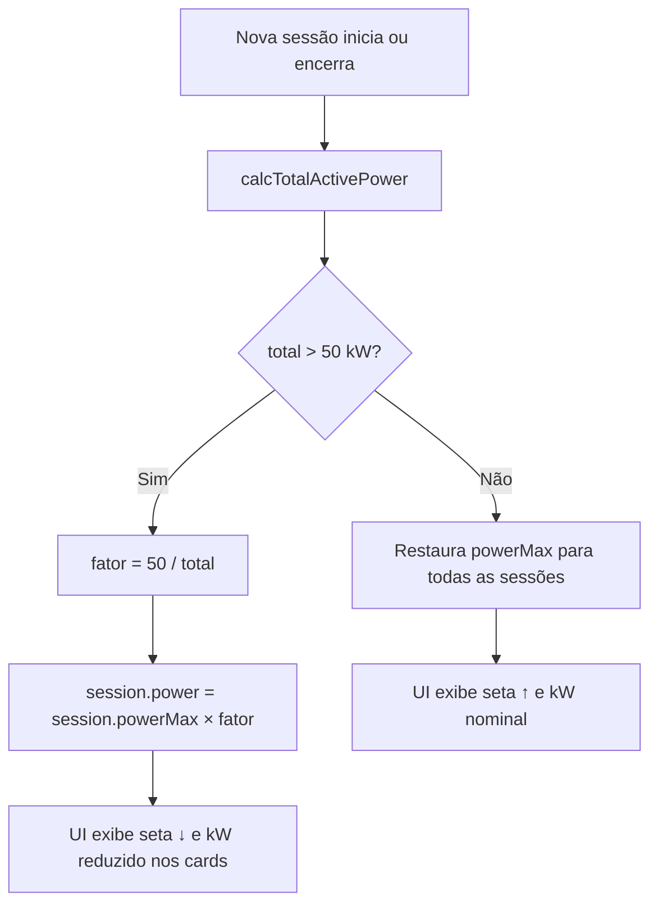


#### Exemplo concreto

Quatro veículos no plano Ultra a 22 kW cada solicitam 88 kW no total:

```
fator = 50 / 88 = 0,568
cada session.power = 22 × 0,568 = 12,5 kW
```

A barra de demanda fica vermelha acima de 90% de utilização. Os cards exibem `12,5 kW / 22 kW` com seta para baixo.

#### Tratamento de overflow com FIFO

Quando as quatro estações estão ocupadas e um quinto veículo chega, `session-form.js` o enfileira:

```javascript
if (activeSessions.size >= MAX_STATIONS && !activeSessions.has(stationId)) {
  waitingQueue.enqueue(queued);
}
```

Quando qualquer sessão termina, `stopSession()` promove automaticamente o próximo veículo da fila:

```javascript
if (!waitingQueue.isEmpty) {
  const next = waitingQueue.dequeue();
  startSession(stationId, Object.assign(next, { stationId }));
}
```

#### Evidências na interface

- Widget da barra de demanda: `total kW / 50 kW` com preenchimento codificado por cor (verde, alerta, perigo)
- Legenda com limiares de sobretaxa tarifária em 40%, 70% e 90%
- "Simular Demanda Máxima" inicia 4 veículos Ultra (88 kW solicitados, limitados a 50 kW)
- Indicador de throttling por card (↑ nominal, ↓ reduzido)

---

### Critério 3: Lógica de Tarifação Dinâmica (0–15 pontos)

#### O que o critério exige

Precificação que varia conforme horário do dia, nível de demanda da grade e tipo de usuário. Não é uma tarifa fixa.

#### Como está implementado

**Fórmula central** (`tariff.js`):

```javascript
function calcPricePerKwh(basePricePerKwh, hour, userType, demandRatio) {
  let price = basePricePerKwh;

  if (hour >= 0  && hour < 6)  price *= 0.70;  // Desconto noturno
  if (hour >= 18 && hour < 22) price *= 1.30;  // Sobretaxa de pico

  const demandRule = [...tariffRules.demand]
    .reverse()
    .find(r => demandRatio >= r.threshold);
  price *= demandRule.multiplier;

  if (userType === "premium") price *= 0.85;

  return price;
}
```

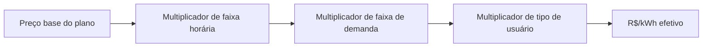


#### Fatores tarifários


| Fator           | Condição                  | Multiplicador |
| --------------- | ------------------------- | ------------- |
| Madrugada       | 00:00 às 06:00            | × 0,70        |
| Diurno          | 06:00 às 18:00            | × 1,00        |
| Pico            | 18:00 às 22:00            | × 1,30        |
| Demanda 0–40%   | `demandRatio < 0.4`       | × 1,00        |
| Demanda 40–70%  | `0.4 ≤ demandRatio < 0.7` | × 1,10        |
| Demanda 70–90%  | `0.7 ≤ demandRatio < 0.9` | × 1,25        |
| Demanda > 90%   | `demandRatio ≥ 0.9`       | × 1,50        |
| Usuário premium | `userType === "premium"`  | × 0,85        |


#### Exemplo numérico

Plano Plus (R$ 1,10/kWh), horário de pico (× 1,30), demanda a 75% (× 1,25), usuário premium (× 0,85):

```
1,10 × 1,30 × 1,25 × 0,85 = R$ 1,52/kWh
```

#### Recálculo em tempo real

O tick global recalcula `session.pricePerKwh` a cada segundo usando a hora atual e a razão de demanda:

```javascript
const demandRatio = calcTotalActivePower() / GRID_CAPACITY_KW;
session.pricePerKwh = calcPricePerKwh(
  session.plan.pricePerKwh, hour, session.userType, demandRatio
);
```

#### Breakdown na interface

O componente `tariff-breakdown` renderiza a fórmula por sessão ativa:

```
R$ 1,10 (base) × 1,30 (Pico) × 1,25 (demanda) × 0,85 (premium) = R$ 1,52/kWh
```

O botão "Simular Horário de Pico" define `simulatedHour = 20` para forçar tarifa de pico independentemente do relógio real.

#### Evidências na interface

- Painel de breakdown tarifário com fatores atualizados em tempo real por estação
- Legenda da barra de demanda correlacionando carga da grade com faixas de sobretaxa
- Alternância de simulação de horário de pico
- Seletor de tipo de usuário premium vs. padrão no formulário de sessão

---

### Critério 4: Simulação de Integração OCPP / MODBUS (0–15 pontos)

#### O que o critério exige

Simular comunicação com plataforma externa usando mensagens estruturadas de protocolo, não apenas prints no console.

#### Implementação OCPP 1.6

**Barramento de mensagens** (`ocpp.js`):

```javascript
class OCPPMessageBus {
  send(action, payload) {
    const id = "msg_" + Date.now();
    const frame = [2, id, action, payload];  // Frame Call
    this.queue.enqueue(frame);
    this._log("→ SEND", action, payload);
    setTimeout(() => this._autoRespond(id, action), 300);
    return id;
  }

  _autoRespond(id, action) {
    const frame = [3, id, responses[action]];  // Frame CallResult
    this._log("← RECV", action + "Response", resp);
  }
}
```

O formato de frame OCPP segue a estrutura padrão em array:


| Tipo de Frame | Formato do Array                 | Exemplo                                     |
| ------------- | -------------------------------- | ------------------------------------------- |
| Call          | `[2, uniqueId, action, payload]` | `[2, "msg_123", "StartTransaction", {...}]` |
| CallResult    | `[3, uniqueId, payload]`         | `[3, "msg_123", { transactionId: 4521 }]`   |


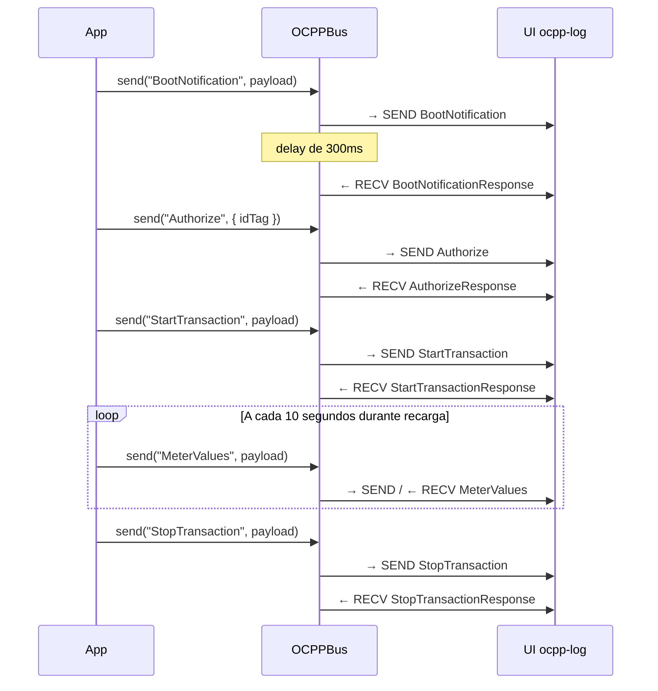


**Chamadas de protocolo no ciclo de vida da sessão** (`session-ops.js`):

No início: `BootNotification` → `Authorize` → `StartTransaction` (escalonadas a cada 300ms)

No tick (a cada 10 segundos): `MeterValues` com ID do conector, ID da transação e leitura do medidor

No encerramento: `StopTransaction` com valor final do medidor

**Respostas automáticas:**


| Ação             | Payload de Resposta                                    |
| ---------------- | ------------------------------------------------------ |
| BootNotification | `{ status: "Accepted", currentTime, interval: 30 }`    |
| Authorize        | `{ idTagInfo: { status: "Accepted" } }`                |
| StartTransaction | `{ transactionId, idTagInfo: { status: "Accepted" } }` |
| StopTransaction  | `{ idTagInfo: { status: "Accepted" } }`                |
| MeterValues      | `{}`                                                   |


#### Implementação MODBUS

**Atualização de registros** (`modbus.js`):

```javascript
function updateModbusFromSession(session) {
  modbusRegisters[0x0001].value = voltageRaw;   // ~220 V
  modbusRegisters[0x0002].value = currentRaw;     // derivado de session.power
  modbusRegisters[0x0003].value = powerRaw;       // session.power × 1000 W
  modbusRegisters[0x0004].value = energyRaw;    // Wh acumulados entregues
  modbusRegisters[0x0005].value = tempRaw;      // temperatura simulada do conector
}
```

Chamada a cada tick global a partir de `state.js`, usando a primeira sessão ativa como fonte de dados.

#### Evidências na interface

- **Seção Protocolo:** log OCPP ao vivo com setas de direção (→ SEND / ← RECV), nomes de ação, timestamps e payloads JSON
- **Seção Protocolo:** tabela MODBUS com endereço (hex), rótulo, valor físico escalado e valor bruto do registro
- Mensagens aparecem automaticamente ao iniciar sessões, durante a recarga e no encerramento

---

### Critério 5: Estrutura Lógica do Sistema (0–10 pontos)

#### O que o critério exige

Organização limpa e modular com separação clara de responsabilidades.

#### Como está implementado

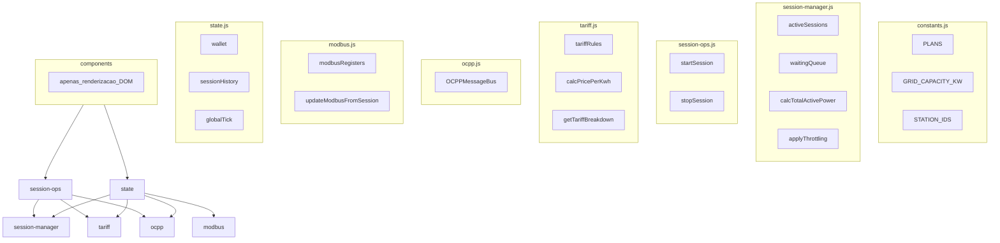


| Módulo               | Responsabilidade                     | Acesso ao DOM                   |
| -------------------- | ------------------------------------ | ------------------------------- |
| `constants.js`       | Configuração estática                | Não                             |
| `helpers.js`         | Funções utilitárias puras            | Não                             |
| `queue.js`           | Estrutura de dados FIFO              | Não                             |
| `tariff.js`          | Regras e cálculo de tarifação        | Não                             |
| `session-manager.js` | Map de sessões, throttling           | Não                             |
| `session-ops.js`     | Ciclo de vida início/fim, cobrança   | Não                             |
| `ocpp.js`            | Barramento de mensagens de protocolo | Não (chama render via callback) |
| `modbus.js`          | Simulação de registros               | Não                             |
| `state.js`           | Tick global, persistência            | Não                             |
| `components/*`       | Renderização e binding de eventos    | Sim                             |


**Regras de enforcement:**

- Nenhum arquivo ultrapassa 100 linhas (componentes grandes divididos em helpers `-build.js`)
- Componentes nunca contêm cálculo tarifário, lógica de throttling ou framing de protocolo
- Todas as entradas numéricas validadas com `Number.isFinite()` antes do uso

---

### Critério 6: Interatividade (Menu e Fluxo) (0–10 pontos)

#### O que o critério exige

Menu interativo intuitivo que guie o usuário por todas as funcionalidades do sistema.

#### Estrutura de navegação

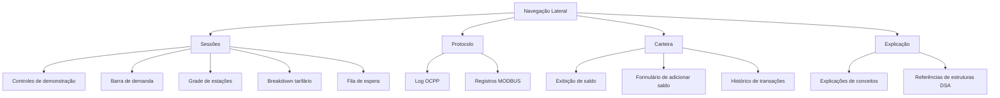


#### Fluxo do usuário para iniciar uma sessão

1. Navegar para **Sessões** (seção ativa por padrão)
2. Clicar em **Iniciar Recarga** em um card de estação livre
3. Modal abre: configurar ID do veículo, tipo de usuário, plano, capacidade da bateria e carga inicial %
4. Confirmar → handshake OCPP dispara → card entra em modo de recarga
5. Atualizações ao vivo: barra de bateria, potência, tempo, custo, breakdown tarifário
6. Clicar em **Encerrar** → sessão arquivada → carteira debitada → estação volta para Livre

#### Controles de demonstração (cenários com um clique)


| Botão                   | Ação                                                                  |
| ----------------------- | --------------------------------------------------------------------- |
| Simular 3 Veículos      | Inicia VH-01, VH-02, VH-03 nas estações A, B, C com planos diferentes |
| Encerrar Todos          | Encerra todas as sessões ativas e reseta a velocidade do tick         |
| Simular Demanda Máxima  | Inicia 4 veículos Ultra para acionar throttling (88 kW → 50 kW)       |
| Simular Fila de Espera  | Preenche as 4 estações e enfileira VH-Q5 com tick acelerado 5×        |
| Simular Horário de Pico | Alterna hora simulada para 20:00 para testar tarifa de pico           |


#### Evidências na interface

- Sidebar persistente com destaque da seção ativa e saldo da carteira ao vivo
- Formulário modal com mensagens de erro de validação em português
- Títulos das seções atualizados dinamicamente na navegação
- Relógio em tempo real no cabeçalho

---

### Critério 7: Qualidade Geral e Robustez (0–10 pontos)

#### O que o critério exige

Sistema estável e consistente, com comportamento próximo a uma plataforma real de gerenciamento de recarga.

#### Medidas de robustez


| Preocupação                     | Solução                                                                       | Arquivo                             |
| ------------------------------- | ----------------------------------------------------------------------------- | ----------------------------------- |
| Vazamento de memória por timers | Tick global único, nunca duplicado                                            | `state.js`                          |
| Entrada inválida no formulário  | Verificações `Number.isFinite()` em capacidade e % inicial                    | `session-form.js`, `session-ops.js` |
| Perda de dados ao recarregar    | Persistência no `localStorage` para carteira e histórico                      | `state.js`                          |
| Atualizações DOM obsoletas      | Atualização incremental via `updateStationCard()` quando estrutura inalterada | `station-card.js`                   |
| Overflow do log OCPP            | Log limitado a 50 entradas, UI exibe as 20 mais recentes                      | `ocpp.js`, `ocpp-log.js`            |
| Saldo negativo na carteira      | `Math.max(0, balance - cost)` impede saldo negativo                           | `session-ops.js`                    |
| Conclusão automática de sessão  | Tick global chama `stopSession()` quando bateria atinge 100%                  | `state.js`                          |
| Promoção da fila                | Dequeue automático e início de sessão ao liberar estação                      | `session-ops.js`                    |


#### Design do tick global

```javascript
function startGlobalTick() {
  if (globalTick) return;  // Proteção contra intervalos duplicados
  globalTick = setInterval(() => {
    activeSessions.forEach((session, stationId) => {
      session.elapsedMinutes += tickMultiplier;
      session.pricePerKwh = calcPricePerKwh(...);
      if (_tickCount % 10 === 0) ocppBus.send("MeterValues", ...);
      if (calcCurrentPct(session) >= 100) stopSession(stationId);
    });
    if (typeof renderAll === "function") renderAll();
  }, TICK_INTERVAL_MS);
}
```

Um único intervalo dirige todas as sessões. Sem timers órfãos quando sessões encerram.

#### Geração de relatórios

Quando uma sessão encerra, um registro completo é criado:

```javascript
const record = {
  id, stationId, vehicleId, date, plan, userType,
  power, pricePerKwh, durationMinutes, energyKwh, totalCost,
  initialPct, finalPct, batteryCapacity,
};
state.sessionHistory.unshift(record);
```

Transações da carteira espelham os débitos de sessão com rótulos descritivos:

```
Recarga · Estação A · 10%→85%
```

#### Evidências na interface

- Sessões sobrevivem a interações na página sem travamentos
- Saldo da carteira e histórico de transações persistem após recarregar o navegador
- Simulação de recarga roda suavemente com velocidade configurável (`tickMultiplier`)
- Todos os cenários de demonstração executam sem configuração manual

---

## 5. Ciclo de Vida da Sessão

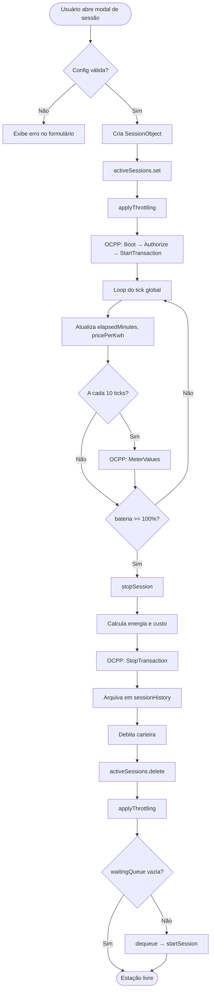


### Cálculos de energia e bateria

```javascript
function calcEnergyDelivered(session) {
  return (session.power / 60) * session.elapsedMinutes;  // kWh
}

function calcCurrentPct(session) {
  const energyDelivered = (session.power / 60) * session.elapsedMinutes;
  return Math.min(100, session.initialPct + (energyDelivered / session.batteryCapacity) * 100);
}
```

Potência em kW. Tempo decorrido em minutos. Energia entregue = potência × (minutos / 60).

---

## 6. Simulação de Protocolos

### 6.1 Tipos de Mensagem OCPP Utilizados


| Fase         | Direção | Ação                     | Gatilho                         |
| ------------ | ------- | ------------------------ | ------------------------------- |
| Conexão      | → SEND  | BootNotification         | Início da sessão                |
| Conexão      | ← RECV  | BootNotificationResponse | Automático (300ms)              |
| Autenticação | → SEND  | Authorize                | Início da sessão + 300ms        |
| Autenticação | ← RECV  | AuthorizeResponse        | Automático (300ms)              |
| Transação    | → SEND  | StartTransaction         | Início da sessão + 600ms        |
| Transação    | ← RECV  | StartTransactionResponse | Automático (300ms)              |
| Medição      | → SEND  | MeterValues              | A cada 10 ticks durante recarga |
| Medição      | ← RECV  | MeterValuesResponse      | Automático (300ms)              |
| Encerramento | → SEND  | StopTransaction          | Encerramento da sessão          |
| Encerramento | ← RECV  | StopTransactionResponse  | Automático (300ms)              |


### 6.2 Mapa de Registros MODBUS


| Endereço | Rótulo         | Unidade | Fator | Derivação                  |
| -------- | -------------- | ------- | ----- | -------------------------- |
| 0x0001   | Tensão         | V       | 0.1   | Simulado 220–225 V         |
| 0x0002   | Corrente       | A       | 0.1   | `power × 1000 / 220`       |
| 0x0003   | Potência Ativa | W       | 1     | `power × 1000`             |
| 0x0004   | Energia Total  | Wh      | 1     | Energia acumulada entregue |
| 0x0005   | Temperatura    | °C      | 0.1   | Simulado 35–45 °C          |


---

## 7. Menu Interativo e Cenários de Demonstração

### 7.1 Seções da Sidebar


| Seção      | ID                    | Conteúdo                                                 |
| ---------- | --------------------- | -------------------------------------------------------- |
| Sessões    | `section-sessions`    | Estações, barra de demanda, tarifa, fila, botões de demo |
| Protocolo  | `section-protocol`    | Log OCPP e tabela de registros MODBUS                    |
| Carteira   | `section-wallet`      | Saldo, adicionar fundos, histórico de transações         |
| Explicação | `section-explanation` | Cards educacionais explicando conceitos DSA              |


### 7.2 Sequência Recomendada de Demonstração

Para uma apresentação completa de avaliação, execute estes cenários na ordem:

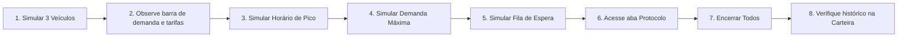


1. **Três veículos:** demonstra gerenciamento multi-sessão com planos e tipos de usuário diferentes
2. **Alternância de horário de pico:** demonstra multiplicador tarifário por horário (× 1,30)
3. **Demanda máxima:** aciona throttling nas quatro estações Ultra (88 kW → 50 kW)
4. **Fila de espera:** preenche todas as estações, enfileira VH-Q5, acelera tick para 5×
5. **Aba Protocolo:** exibe mensagens OCPP acumuladas e registros MODBUS ao vivo
6. **Encerrar todos:** gera relatórios de sessão e débitos na carteira
7. **Aba Carteira:** revisa histórico de transações e saldo restante

### 7.3 Planos de Recarga


| ID do Plano | Nome   | Potência | Preço Base  |
| ----------- | ------ | -------- | ----------- |
| `basic`     | Básico | 3,7 kW   | R$ 1,40/kWh |
| `plus`      | Plus   | 7,4 kW   | R$ 1,10/kWh |
| `ultra`     | Ultra  | 22 kW    | R$ 0,80/kWh |


---

## 8. Persistência e Robustez

### Esquema do localStorage


| Chave         | Conteúdo                      | Atualizado Quando                       |
| ------------- | ----------------------------- | --------------------------------------- |
| `ss2_wallet`  | `{ balance, transactions[] }` | Encerramento de sessão, adição de saldo |
| `ss2_history` | `SessionRecord[]`             | Encerramento de sessão                  |


### Resumo de Validação de Entrada


| Campo                 | Validação                                     |
| --------------------- | --------------------------------------------- |
| Capacidade da bateria | `Number.isFinite()` e `> 0`                   |
| Carga inicial %       | `Number.isFinite()`, `≥ 0`, `< 100`           |
| ID do veículo         | String não vazia                              |
| Depósito na carteira  | `Number.isFinite()` e `> 0`                   |
| ID do plano           | Deve corresponder a um plano no array `PLANS` |


---

## 9. Estrutura do Projeto

```
second-sprint/
├── index.html                          Ponto de entrada, controles de demo, renderAll()
├── technical-document.md               Este documento técnico
├── README.md                           Visão geral do projeto (pt-BR)
│
├── css/base/
│   ├── tokens.css                      Design tokens (variáveis CSS)
│   ├── reset.css                       Reset CSS
│   ├── animations.css                  Animações de transição de estado
│   ├── buttons.css                     Estilos de botões
│   └── forms.css                       Estilos de formulários e modais
│
├── js/core/
│   ├── constants.js                    PLANS, GRID_CAPACITY_KW, STATION_IDS
│   ├── helpers.js                      formatBRL, calcEnergyDelivered, calcCurrentPct
│   ├── queue.js                        Classe Queue (FIFO)
│   ├── tariff.js                       tariffRules, calcPricePerKwh, getTariffBreakdown
│   ├── ocpp.js                         OCPPMessageBus, messageLog
│   ├── modbus.js                       modbusRegisters, updateModbusFromSession
│   ├── session-manager.js              Map activeSessions, applyThrottling
│   ├── session-ops.js                  startSession, stopSession
│   └── state.js                        wallet, sessionHistory, tick global, persistência
│
└── components/
    ├── sidebar/                        Navegação e exibição de saldo
    ├── station-card/                   Card de recarga por estação (build + render)
    ├── demand-bar/                     Visualização de demanda da grade
    ├── session-form/                   Modal de configuração de sessão
    ├── tariff-breakdown/               Exibição da fórmula tarifária ao vivo
    ├── ocpp-log/                       Painel de log de mensagens OCPP
    ├── modbus-table/                   Tabela de registros MODBUS
    ├── waiting-queue/                  Exibição da fila FIFO
    ├── wallet/                         Saldo e histórico de transações
    └── explanation/                    Cards educacionais de conceitos
```

---

## 10. Como Executar

1. Clone o repositório:

```bash
git clone https://github.com/goodwe-challenge/sprints.git
```

1. Navegue até o diretório da Sprint 2:

```bash
cd data-structures-and-algorithms/second-sprint
```

1. Abra `index.html` em qualquer navegador moderno (Chrome, Firefox, Safari, Edge). Não é necessário build nem servidor.
2. Use os botões de demonstração na página **Sessões** para executar cenários pré-definidos, ou clique em **Iniciar Recarga** nos cards individuais para configuração manual.
3. Acesse **Protocolo** para inspecionar saída OCPP e MODBUS, **Carteira** para histórico de cobrança e **Explicação** para referência de conceitos.

---

## Projeção de Nota por Critério


| Critério                              | Pontos Máximos | Nível de Implementação                                    |
| ------------------------------------- | -------------- | --------------------------------------------------------- |
| 1. Gerenciamento de múltiplas sessões | 20             | Controle completo via Map, 4 estações, fila FIFO          |
| 2. Controle de demanda de energia     | 20             | Throttling proporcional a 50 kW, barra de demanda visual  |
| 3. Lógica de tarifação dinâmica       | 15             | Horário × demanda × tipo com breakdown ao vivo            |
| 4. Simulação OCPP/MODBUS              | 15             | Frames estruturados, respostas automáticas, painéis na UI |
| 5. Estrutura lógica do sistema        | 10             | Separação rigorosa core/componentes, arquivos modulares   |
| 6. Interatividade                     | 10             | Navegação lateral, formulários modais, 5 cenários de demo |
| 7. Qualidade e robustez               | 10             | Persistência, validação, tick único, conclusão automática |
| **Total**                             | **100**        |                                                           |


---

*Thunderbolt Sprint 2 · GoodWe Challenge*