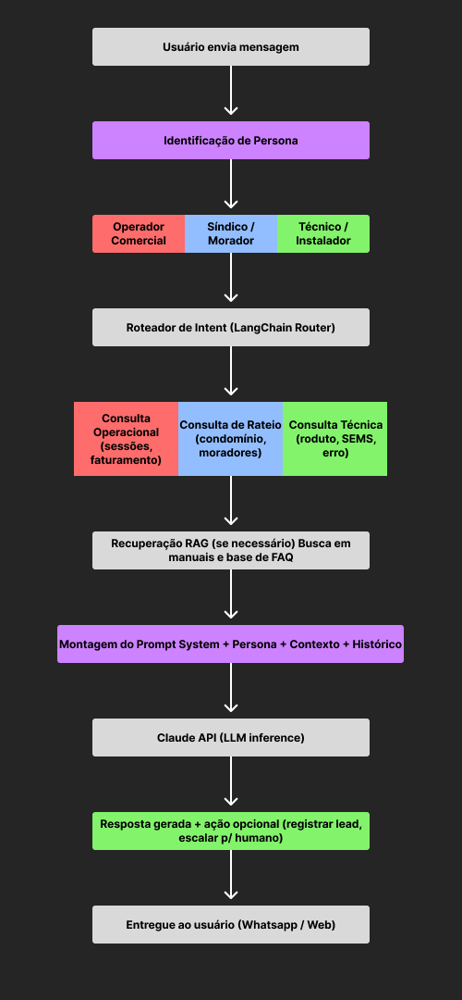

# GoodWe EV Challenge — Chatbot com IA

## Integrantes do Grupo

* Davi Ramos - RM: 571744
* Lucas Malchior - RM: 504027
* Gustavo Rocha - RM: 570672
* Victor - RM: 571099
* Timothée Campos Ferraz - RM: 568688
* Gabriel Cavaloti - RM: 571643

---

## O Problema Abordado

A distribuição de carregadores de veículos elétricos (EVs) no Brasil enfrenta desafios críticos de rentabilidade e disponibilidade. A GoodWe possui excelência em hardware, mas o desafio central não é apenas instalar carregadores, e sim tornar os eletropostos **operacionalmente inteligentes**.

Identificamos os seguintes gaps operacionais e comerciais:

* **ChargeGrid Intelligence (Operação Comercial):** Eletropostos públicos carecem de integração para orquestrar potência, registrar ciclos com rastreabilidade, faturar de forma automatizada e comunicar falhas em tempo real.
* **EV ChargeOps (Condomínios):** Falta de sistemas para rateio justo de energia, controle de acesso por unidade habitacional e transparência no faturamento.
* **Barreiras de Adoção:** Instaladores e revendedores têm dificuldade em dimensionar projetos para clientes, enquanto os consumidores finais esbarram em um suporte técnico fragmentado e processos de vendas com baixa conversão.

## A Proposta do Chatbot

Para resolver essa lacuna entre o hardware competitivo da GoodWe e a operação diária, propomos uma **camada de inteligência e interface** baseada em IA.

O chatbot atuará como um assistente multifuncional capaz de:

1. **Auxiliar clientes finais e instaladores:** Qualificando leads, recomendando o hardware correto, auxiliando no dimensionamento técnico e simulando economia/payback.
2. **Gerenciar a operação:** Respondendo perguntas de operadores comerciais sobre sessões, consumo e faturamento.
3. **Administrar condomínios:** Ajudando síndicos e moradores com rateio de custos, status de disponibilidade e agendamento de recargas.
4. **Automatizar o suporte técnico:** Atuando como primeiro nível para troubleshooting e configuração na plataforma SEMS+.

## Tecnologias Selecionadas e Justificativa

* **LLM Principal:** Claude (Anthropic) — `claude-sonnet-4-20250514`
* *Justificativa:* Selecionado por seu excelente desempenho em raciocínio técnico e janela de contexto longa, o que permite injetar bases de conhecimento (manuais, FAQs) sem truncar informações.


* **Orquestração:** LangChain (Python)
* *Justificativa:* Facilita a criação de cadeias de raciocínio, roteamento por persona e integração nativa para recuperação de contexto (RAG).


* **Recuperação de Conhecimento:** RAG com ChromaDB
* *Justificativa:* Indexa documentação técnica da GoodWe (como manuais HCA), garantindo respostas fundamentadas e reduzindo drasticamente o risco de alucinações.


* **Interface:** WhatsApp Business API (via Twilio) e Web Chat (React)
* *Justificativa:* O WhatsApp elimina fricções de adoção por ser o canal dominante no Brasil para comunicação B2C e B2B. A Twilio permite testes ágeis via sandbox gratuito.


## Fluxograma de Funcionamento

Abaixo está a representação da arquitetura lógica do roteamento e resposta do nosso chatbot:



<!-- ```text
┌─────────────────────────────────────────────────────────┐
│                    USUÁRIO ENVIA MENSAGEM               │
└─────────────────────────┬───────────────────────────────┘
                          │
                          ▼
              ┌───────────────────────┐
              │  Identificação de     │
              │  Persona              │
              │  (primeira interação) │
              └───────────┬───────────┘
                          │
          ┌───────────────┼───────────────┐
          ▼               ▼               ▼
    Operador        Síndico /        Técnico /
    Comercial        Morador         Instalador
          │               │               │
          └───────────────┼───────────────┘
                          │
                          ▼
              ┌───────────────────────┐
              │   Roteador de Intent  │
              │  (LangChain Router)   │
              └───────────┬───────────┘
                          │
           ┌──────────────┼──────────────┐
           ▼              ▼              ▼
     Consulta         Consulta       Consulta
     Operacional      de Rateio      Técnica
     (sessões,        (condomínio,   (produto,
      faturamento)     moradores)     SEMS, erro)
           │              │              │
           └──────────────┼──────────────┘
                          │
                          ▼
              ┌───────────────────────┐
              │  Recuperação RAG      │
              │  (se necessário)      │
              │  Busca em manuais     │
              │  e base de FAQ        │
              └───────────┬───────────┘
                          │
                          ▼
              ┌───────────────────────┐
              │  Montagem do Prompt   │
              │  System + Persona +   │
              │  Contexto + Histórico │
              └───────────┬───────────┘
                          │
                          ▼
              ┌───────────────────────┐
              │   Claude API          │
              │   (LLM inference)     │
              └───────────┬───────────┘
                          │
                          ▼
              ┌───────────────────────┐
              │  Resposta gerada      │
              │  + ação opcional      │
              │  (registrar lead,     │
              │   escalar p/ humano)  │
              └───────────┬───────────┘
                          │
                          ▼
              ┌───────────────────────┐
              │  Entregue ao usuário  │
              │  (WhatsApp / Web)     │
              └───────────────────────┘

``` -->

*(Se o bot não atingir confiança na resposta ou o usuário solicitar, a conversa será transferida para atendimento humano).*

## Modelo de Teste (Golden Set de Avaliação)

Desenvolvemos 5 cenários-chave que servirão de critério de aceitação qualitativa para o comportamento do modelo:

| Persona | Pergunta do Usuário | Resposta Ideal Esperada | Critério de Sucesso |
| --- | --- | --- | --- |
| **Operador Comercial** | "Quantas sessões de carga foram realizadas hoje no meu eletroposto e qual foi o consumo total em kWh?" | "Hoje foram registradas **12 sessões**. O consumo total foi de **87,4 kWh**... Quer ver o detalhamento por sessão?" | Uso correto dos dados mockados da API, métricas corretas e call-to-action (CTA). |
| **Síndico** | "Como faço para dividir o custo da energia entre os moradores em abril?" | Detalhamento dos moradores (Apto 42, 87 e 15), kWh de cada um e o valor monetário calculado (Ex: Apto 42 - R$ 32,49). | Cálculo matemático exato com base na tarifa, clareza na separação e oferta para gerar PDF. |
| **Morador** | "O carregador da vaga 12 está disponível agora?" | "Sim, o carregador da vaga 12 está **disponível e online**. Potência disponível: 7 kW. Deseja agendar?" | Status preciso em tempo real, resposta enxuta e oferta de agendamento. |
| **Técnico / Instalador** | "O carregador HCA G2 está mostrando o erro E-04. O que significa e como resolver?" | "Erro **E-04** indica **falha de comunicação com o inversor**. Passos: 1. Verifique cabo RS485... 2. Reinicie... 3. Sincronize no SEMS+..." | Resolução step-by-step extraída via RAG do manual, com alternativa técnica para abrir chamado. |
| **Operador Comercial** | "Como configuro o preço por kWh para cobrar dos clientes?" | Passo a passo no SEMS+: Configurações > Eletroposto > Tarifação > Editar tarifa > Salvar. | Instrução de software clara, acessível a não-técnicos e com oferta de relatório. |

## System Prompt (Contexto-Base da IA)

Para garantir que o modelo Claude forneça as respostas corretas, ele será condicionado pelo seguinte System Prompt na inicialização da sessão:

```text
Você é o assistente virtual oficial da GoodWe Brasil, especializado em gestão, operação e suporte técnico da linha de carregadores de veículos elétricos (EV Chargers) e da plataforma SEMS+.
Sua missão é fornecer respostas precisas, educadas e altamente resolutivas.

INFORMAÇÕES DE CONTEXTO ATUAL:
- Persona Identificada: {persona_do_usuario}
- Dados da Estação/Usuário (Mock API): {dados_sessao_api}
- Documentação Recuperada (RAG): {trechos_manuais_goodwe}

REGRAS DE COMPORTAMENTO:
1. FOCO NO USUÁRIO: Molde seu vocabulário à persona. Seja didático com moradores/clientes finais; seja altamente técnico, direto e focado em parâmetros com instaladores e técnicos.
2. PRECISÃO TÉCNICA: Baseie-se exclusivamente nos manuais GoodWe fornecidos no contexto. Nunca invente especificações técnicas, códigos de erro ou procedimentos elétricos.
3. CONCISÃO E AÇÃO: Forneça a resposta de forma estruturada (bullet points ou passos numerados quando aplicável). Termine a interação oferecendo um "próximo passo" lógico (ex: gerar um relatório, agendar carga, abrir chamado).
4. ESCALONAMENTO: Se a documentação não cobrir o problema ou se envolver risco elétrico severo não documentado, direcione imediatamente para a equipe de suporte humano ou comercial da GoodWe.

Inicie a interação cumprimentando o usuário de acordo com o seu perfil e aguarde a dúvida.

```